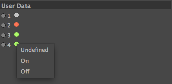

c4dpl-tristate-gui
==================

This plugin adds a new custom GUI to the Cinema 4D User Interface. It
is a traffic-light like interface for representing three states: Undefined,
On and Off. This is very similar to the editor- and rendermodes of objects
in the Cinema 4D Object Manager.

Installation
============

The current binaries in the repository are built for Cinema 4D R14+ on Mac
and R13+ on Windows (will be added soon). Simply copy the folder to your
Cinema 4D plugins directory.

License
=======

The source code is licensed under the GNU Lesser General Public license (see
the COPYING file).

Todo
====

- Make an image for the multiple values state of the GUI
(`res/tristate-multiple.png`)
- Implement displaying boolean values by simply not displaying the
"undefined" state of the traffic lights
